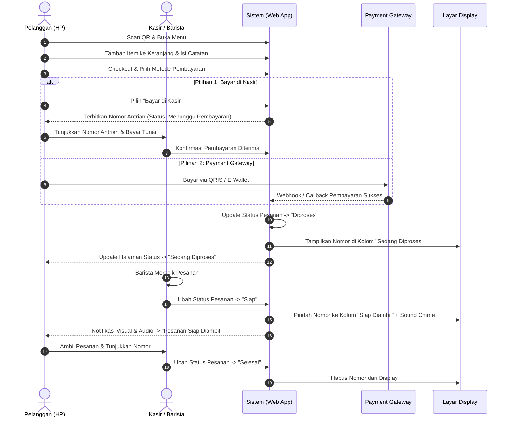

# Product Requirements Document (PRD)
## Sistem Pemesanan Mandiri (QR Self-Order), Kasir & Antrian Cerdas Coffee Shop

| | |
|---|---|
| **Nama Produk** | Kopi Senja — Sistem Self-Order QR, Kasir & Antrian Cerdas |
| **Jenis Dokumen** | PRD (Product Requirements Document) |
| **Mata Kuliah** | PAW (Pengembangan Aplikasi Web) — Final Project |
| **Kelompok** | Kelompok 3 |
| **Repositori** | github.com/iizaghz/final-project-Kelompok-3 |
| **Drive** | [Link Drive](https://drive.google.com/drive/folders/1JJwn7uKRks8dhfiiyzq7b8TZ_HwLipRE?usp=sharing) |
| **Versi Dokumen** | 2.0  |
| **Status** | Approved / Siap Implementasi |

---

## 1. Latar Belakang & Tujuan

### 1.1 Latar Belakang
Pada operasional coffee shop konvensional, penumpukan antrian fisik di depan meja kasir sering kali menimbulkan ketidaknyamanan bagi pelanggan dan memperlambat alur kerja barista/kasir, terutama saat jam sibuk (*peak hours*). Selain itu, kasir kerap kesulitan memberikan penjelasan detail komposisi menu baru secara konsisten, serta pelanggan kesulitan mengetahui kepastian kapan pesanan mereka selesai dibuat.

Untuk menjawab permasalahan tersebut, sistem ini mengintegrasikan:
1. **Self-Ordering Pelanggan (QR Code Menu)**: Pelanggan dapat memindai QR code di meja/outlet, memilih menu, memesan langsung dari perangkat mereka (*smartphone*), dan memilih metode pembayaran (*Bayar di Kasir* atau *Payment Gateway*).
2. **Dashboard & Manajemen Kasir**: Kasir mengonfirmasi pesanan, menerima pembayaran kasir, memantau *workflow* produksi pesanan, serta mengelola katalog menu dengan bantuan AI.
3. **Sistem Antrian & Notifikasi Realtime**: Memberikan kejelasan nomor antrian dan status pesanan (*Diproses → Siap → Selesai*) bagi pelanggan dan display publik.
4. **Asisten AI (Gemini API)**: Membantu tim coffee shop membuat deskripsi menu yang menarik dan konsisten secara otomatis.

### 1.2 Tujuan Produk
- **Mempercepat Alur Pemesanan**: Mengurangi antrian fisik di meja kasir dengan memungkinkan pelanggan memesan mandiri (*self-ordering*) via scan QR code.
- **Fleksibilitas Pembayaran**: Mendukung 2 metode pembayaran utama: pembayaran langsung di kasir (tunai/manual) dan pembayaran online otomatis (*Payment Gateway*).
- **Transparansi Status & Antrian Realtime**: Memberikan nomor antrian terstruktur dan pembaruan status pesanan secara *real-time* kepada pelanggan dan layar display umum.
- **Efisiensi Manajemen Menu Berbasis AI**: Membantu staf menyusun deskripsi produk kreatif menggunakan integrasi Google Gemini API.
- **Standar PAW Capstone**: Memenuhi standar proyek akhir pengembangan aplikasi web *full-stack* modern (Backend REST API + Frontend SPA responsif) dengan arsitektur bersih dan alur transaksi end-to-end.

### 1.3 Target Pengguna
| Peran | Deskripsi Akses & Kebutuhan |
|---|---|
| **Pelanggan (Customer)** | Mengakses aplikasi via scan QR code di HP (tanpa registrasi/login wajib), melihat katalog menu & detail, memesan mandiri (*self-order*), memilih metode pembayaran, serta memantau nomor antrian & status pesanan secara *live*. |
| **Kasir / Barista** | Login ke dashboard kasir, melihat pesanan masuk, memverifikasi pembayaran kasir, memperbarui status pesanan (*Diproses*, *Siap*, *Selesai*), dan memanggil nomor antrian. |
| **Admin / Manager** | Mengelola katalog produk dan kategori, memanfaatkan generator deskripsi AI Gemini, serta memantau ringkasan penjualan/pesanan. |
| **Display Publik (TV/Monitor)** | Halaman publik di area coffee shop yang menampilkan antrian pesanan yang sedang diproses dan yang sudah siap diambil. |

---

## 2. Ruang Lingkup (Scope)

### 2.1 In-Scope
- **Pemesanan Mandiri Pelanggan (QR Menu & Self-Order)**:
  - Akses halaman menu digital via QR Code / URL langsung.
  - Katalog produk dengan filter kategori, pencarian, dan modal detail produk.
  - Keranjang belanja (*cart*) interaktif dengan opsi jumlah dan catatan khusus (*notes/customization*).
  - Halaman checkout pemesanan mandiri dengan ringkasan pesanan dan total harga.
- **Opsi Metode Pembayaran (Sesuai Alur 9.1)**:
  - **Bayar di Kasir**: Sistem menerbitkan nomor pesanan/antrian dengan status *Menunggu Pembayaran*. Pelanggan membayar langsung di meja kasir, kemudian kasir mengonfirmasi pelunasan.
  - **Payment Gateway**: Integrasi pembayaran online otomatis (Midtrans / Mock Gateway). Pelanggan menyelesaikan transaksi di halaman pembayaran digital dan status langsung terverifikasi lunas.
- **Manajemen Alur & Antrian Pesanan**:
  - Penomoran antrian otomatis harian (misal `A-001`, `A-002`, dst.).
  - Pelacakan status pesanan: **Menunggu Pembayaran** → **Diproses** → **Siap (Ready)** → **Selesai**.
  - Notifikasi visual dan audio bagi pelanggan ketika status pesanan berubah menjadi *Siap*.
  - Halaman Layar Display Antrian Publik (*TV/Monitor Display*).
- **Dashboard Kasir & Manajemen Menu**:
  - Autentikasi aman untuk kasir/admin (Login/Logout berbasis sesi/JWT).
  - Manajemen pesanan masuk (*incoming orders*) & konfirmasi pembayaran manual.
  - CRUD Produk & Kategori (Nama, Harga, Kategori, Foto, Status Stok/Ketersediaan).
  - Integrasi AI Gemini untuk membuat draft deskripsi produk secara otomatis.

### 2.2 Out-of-Scope (untuk iterasi final project ini)
- Aplikasi mobile native (Android APK / iOS IPA) — aplikasi dioptimasi sebagai Mobile-First Responsive Web Application.
- Fitur pengiriman/delivery jarak jauh dengan kurir eksternal (fokus pada *Dine-in* dan *Takeaway* di outlet).
- Sistem manajemen multi-cabang/multi-outlet (fokus pada single store/outlet).
- Modul akuntansi keuangan mendalam dan perpajakan multi-level.

---

## 3. Tech Stack

| Layer | Teknologi | Peran / Keterangan |
|---|---|---|
| **Frontend** | React.js (Vite) + Tailwind CSS | Antarmuka pengguna responsif (Mobile-first untuk pelanggan & Desktop-friendly untuk kasir/display). |
| **Backend API** | Node.js + Express.js | Menyediakan RESTful API untuk pemesanan, kasir, antrian, produk, dan pembayaran. |
| **Database & Storage** | Supabase (PostgreSQL) | Database relasional cloud berbasis PostgreSQL, Supabase Storage untuk upload gambar produk, dan Supabase Realtime. |
| **AI Integration** | Google Gemini API (`@google/genai` / REST) | Otomatisasi pembuatan deskripsi produk berdasarkan nama & kategori menu. |
| **Payment Gateway** | iPaymu API v2 (Direct Dynamic QRIS) | Pemrosesan pembayaran online (QRIS DANA, GoPay, OVO, ShopeePay, BCA Mobile, dll.) dengan notifikasi webhook callback server-to-server. |
| **Realtime / Sinkronisasi** | Supabase Realtime / Polling Fallback | Sinkronisasi status antrian dan notifikasi pesanan secara instan dan live ke perangkat pelanggan dan layar display. |

---

## 4. Struktur Tim & Pembagian Kerja

| Anggota | NIM | Fokus Tanggung Jawab Modul |
|---|---|---|
| **Salwa Anjaini Futri Endsani** | 20240140139 | Autentikasi Kasir/Admin, Dashboard Kasir & Display Layar Antrian Publik |
| **Sukma Hawa Iza Ghazali** | 20240140148 | Manajemen Produk & Kategori, Detail Produk, dan Integrasi AI Gemini Generator |
| **Nur Zukhrufiyati Sartika Putri** | 20240140154 | Modul Kasir: Manajemen Pesanan Masuk, Konfirmasi Pembayaran Kasir, & Update Status Pesanan |
| **Tasya Maulida Putri** | 20240140239 | Modul Pelanggan: QR Menu, Keranjang & Checkout Mandiri, Payment Gateway, & Pelacakan Antrian Realtime |

---

## 5. User Stories

| ID | Sebagai | Saya ingin | Agar |
|---|---|---|---|
| **US-01** | Pelanggan | Memindai QR Code di meja coffee shop | Dapat langsung mengakses menu digital tanpa perlu mengunduh aplikasi atau antre di kasir. |
| **US-02** | Pelanggan | Melihat daftar menu, kategori, harga, dan detail produk | Memilih minuman dan makanan yang sesuai dengan selera dan anggaran. |
| **US-03** | Pelanggan | Menambahkan produk ke keranjang dan menyisipkan catatan khusus (misal: *less sugar*) | Pesanan saya tercatat dengan spesifik dan akurat. |
| **US-04** | Pelanggan | Melakukan checkout dan memilih metode pembayaran (**Bayar di Kasir** atau **Payment Gateway**) | Dapat membayar sesuai preferensi saya (tunai langsung di kasir atau cashless via online payment). |
| **US-05** | Pelanggan | Mendapatkan nomor antrian dan memantau status pesanan secara *real-time* | Tahu posisi antrian saya dan tidak perlu berdiri menunggu di depan konter. |
| **US-06** | Pelanggan | Menerima notifikasi saat pesanan berstatus **Siap** | Dapat langsung menuju konter untuk mengambil pesanan yang sudah selesai dibuat. |
| **US-07** | Kasir | Login ke dashboard kasir dengan aman | Mengakses menu operasional kasir dan memproses transaksi toko. |
| **US-08** | Kasir | Menerima notifikasi pesanan masuk dan mengonfirmasi pembayaran untuk pesanan "Bayar di Kasir" | Transaksi tercatat valid sebelum pesanan mulai diracik oleh barista. |
| **US-09** | Kasir / Barista | Mengubah status pesanan secara bertahap (**Diproses** → **Siap** → **Selesai**) | Alur produksi terpantau rapi dan pelanggan menerima pembaruan status yang akurat. |
| **US-10** | Admin / Kasir | Mengelola katalog menu dan menggunakan fitur AI Gemini Generator | Menu selalu mutakhir dengan deskripsi produk yang menarik tanpa perlu mengetik manual. |
| **US-11** | Publik / Pelanggan | Melihat layar TV display antrian | Seluruh pengunjung coffee shop dapat melihat nomor pesanan yang sedang diproses dan siap diambil. |

---

## 6. Kebutuhan Fungsional (Functional Requirements)

### 6.1 Pemesanan Mandiri Pelanggan (QR Self-Order)
- **FR-1.1**: Sistem menyediakan akses menu publik melalui URL/QR Code tanpa mewajibkan registrasi atau login.
- **FR-1.2**: Menampilkan katalog menu interaktif yang dapat difilter berdasarkan kategori (e.g. Coffee, Non-Coffee, Pastry, Signature) dan fitur pencarian nama produk.
- **FR-1.3**: Menampilkan halaman/modal detail produk yang berisi foto, nama, kategori, harga, dan deskripsi produk lengkap.
- **FR-1.4**: Pelanggan dapat mengatur kuantitas (*quantity*) dan menambahkan catatan (*order notes*) per item.
- **FR-1.5**: Sistem menyediakan fitur keranjang belanja (*cart*) yang menampilkan ringkasan item yang dipilih beserta subtotal dan total harga.
- **FR-1.6**: Pada tahap *Checkout*, pelanggan mengisi informasi identitas singkat (Nama Pelanggan dan/atau Nomor Meja) dan melihat ringkasan tagihan.

### 6.2 Metode Pembayaran & Verifikasi Transaksi (Sesuai Alur 9.1)
- **FR-2.1**: Sistem menyediakan 2 pilihan metode pembayaran saat checkout:
  - **Opsi A: Bayar di Kasir (Pay at Cashier)**:
    - Sistem langsung menerbitkan pesanan dengan status `menunggu_pembayaran` dan nomor antrian/pesanan.
    - Pelanggan diarahkan ke halaman tiket pesanan untuk ditunjukkan ke kasir saat melakukan pembayaran.
    - Setelah kasir menerima uang/pembayaran dan menekan tombol konfirmasi di dashboard kasir, sistem mengubah status pesanan menjadi `diproses`.
  - **Opsi B: Payment Gateway (iPaymu API v2 - Dynamic QRIS)**:
    - Sistem memanggil iPaymu API v2 (`/api/v2/payment/direct` dengan `paymentMethod: "qris"`) dan menghasilkan Dynamic QRIS yang dapat di-scan langsung lewat aplikasi **DANA**, GoPay, OVO, ShopeePay, BCA Mobile, dll.
    - Setelah pelanggan membayar via DANA/E-Wallet, iPaymu otomatis mengirimkan notifikasi **HTTP POST Callback / Webhook** (`notifyUrl`) ke server backend Express kita.
    - Server memverifikasi callback dan otomatis mengubah status pembayaran menjadi `lunas` (`paid`) serta status pesanan menjadi `diproses` (`processing`).
- **FR-2.2**: Sistem mencatat metode pembayaran, referensi transaksi, waktu pembayaran, dan status pembayaran (`menunggu_pembayaran`, `lunas`, `batal`).

### 6.3 Pelacakan Status Antrian & Notifikasi Pelanggan
- **FR-3.1**: Setelah checkout berhasil, pelanggan otomatis diarahkan ke halaman **Pelacakan Antrian (Order Status Page)**.
- **FR-3.2**: Halaman status menampilkan nomor antrian (misal `A-012`), nama pelanggan, daftar item yang dipesan, dan status tahapan saat ini:
  - `Menunggu Pembayaran` (khusus Bayar di Kasir)
  - `Diproses` (sedang diracik barista)
  - `Siap` (pesanan siap diambil di konter)
  - `Selesai` (pesanan telah diserahkan)
- **FR-3.3**: Sistem memperbarui status antrian secara otomatis (*real-time update*) di perangkat pelanggan.
- **FR-3.4**: Ketika status pesanan berubah menjadi **Siap**, halaman pelanggan memberikan notifikasi visual mencolok (banner/animasi panggil) dan peringatan audio (chime/suara notifikasi).
- **FR-3.5**: Pelanggan dapat kembali ke halaman antrian kapan saja menggunakan kode pesanan/URL unik pesanan mereka.

### 6.4 Layar Display Antrian Publik (Public Display)
- **FR-4.1**: Sistem menyediakan halaman khusus display antrian (`/display` atau `/antrian`) yang dirancang untuk layar besar/TV coffee shop.
- **FR-4.2**: Layar display menampilkan daftar nomor antrian dalam 2 kolom utama:
  - **Sedang Diproses / Preparing** (daftar nomor pesanan yang sedang diracik).
  - **Siap Diambil / Ready for Pickup** (daftar nomor pesanan yang siap diserahkan ke pelanggan).
- **FR-4.3**: Layar display menyinkronkan data antrian secara otomatis dan dapat memutar suara panggil saat nomor baru masuk status siap.

### 6.5 Autentikasi Kasir & Dashboard Operasional
- **FR-5.1**: Sistem menyediakan form login aman khusus staf (Kasir/Admin) menggunakan email/username dan password.
- **FR-5.2**: Akses ke seluruh rute manajemen kasir, pesanan, dan menu dilindungi dengan verifikasi sesi / JWT token.
- **FR-5.3**: Dashboard kasir menampilkan ringkasan operasional harian: total pesanan aktif, pesanan menunggu konfirmasi pembayaran, dan daftar antrian berlangsung.

### 6.6 Manajemen Pesanan & Alur Produksi Kasir
- **FR-6.1**: Kasir dapat melihat daftar pesanan masuk secara langsung (*live order stream*).
- **FR-6.2**: Untuk pesanan *Bayar di Kasir*, kasir dapat mencari berdasarkan nomor antrian/nama pelanggan dan melakukan aksi **"Konfirmasi Pembayaran"** (mengubah status menjadi `diproses`).
- **FR-6.3**: Kasir/barista dapat mengubah status pesanan dari `diproses` menjadi `siap` saat menu selesai dibuat.
- **FR-6.4**: Saat pelanggan mengambil pesanan dengan menunjukkan nomor antrian, kasir menandai pesanan sebagai `selesai`.
- **FR-6.5**: Kasir dapat membatalkan pesanan (*cancel order*) jika terjadi kendala dengan mencantumkan alasan pembatalan.

### 6.7 Manajemen Katalog Produk & Kategori
- **FR-7.1**: Kasir/Admin dapat melihat, menambah, mengedit, dan menghapus (CRUD) data produk dan kategori.
- **FR-7.2**: Setiap produk memiliki atribut: Nama Produk, Kategori, Harga, Deskripsi, URL/File Gambar, dan Status Ketersediaan (*Tersedia / Habis*).
- **FR-7.3**: Produk yang ditandai "Habis" (*Out of Stock*) otomatis tidak dapat dimasukkan ke keranjang oleh pelanggan.

### 6.8 Integrasi AI — Asisten Deskripsi Menu (Gemini API)
- **FR-8.1**: Pada form tambah/edit produk di dashboard admin, disediakan tombol **"Generate Deskripsi dengan AI"**.
- **FR-8.2**: Sistem mengirimkan nama produk dan kategori ke Gemini API dengan prompt khusus bertema *copywriting coffee shop modern dan menggugah selera*.
- **FR-8.3**: Sistem menerima draft deskripsi dari Gemini API dan menampilkannya di form agar kasir/admin dapat meninjau, mengedit, atau langsung menyetujuinya sebelum disimpan ke database.

---

## 7. Kebutuhan Non-Fungsional

| Parameter | Kebutuhan & Standar Kualitas |
|---|---|
| **Usability & UX** | Antarmuka pelanggan mengutamakan *Mobile-First Design* yang bersih, responsif, dan mudah digunakan (alur pemesanan dari scan hingga checkout selesai dalam waktu < 60 detik). |
| **Performance** | Latensi respons API rata-rata < 500ms. Pembaruan status antrian pada perangkat pelanggan dan layar display tampil dalam waktu ≤ 3 detik setelah status diubah kasir. |
| **Security** | Password pengguna kasir/admin dienkripsi dengan *bcrypt*. Sanitasi input pada seluruh form untuk mencegah *SQL Injection* dan *XSS*. Verifikasi tanda tangan (*signature/token*) pada callback webhook payment gateway. |
| **Reliability** | Penomoran antrian menggunakan transaksi database *atomic/auto-increment* per hari agar nomor antrian tidak pernah duplikat/bentrok meskipun pesanan dibuat bersamaan. |
| **Maintainability** | Arsitektur kode modular dan terstruktur rapi (pemisahan Controller, Route, Model, Service di backend; pemisahan Components, Hooks, Pages di frontend). |
| **Compatibility** | Berjalan mulus di seluruh peramban modern (Google Chrome, Safari iOS, Mozilla Firefox, Microsoft Edge) pada perangkat HP, tablet, maupun desktop. |

---

## 8. Skema Data (Supabase PostgreSQL Schema)

### 8.1 Users
| Field | Tipe Data (PostgreSQL) | Keterangan |
|---|---|---|
| `id` | UUID / BIGSERIAL | Primary Key (DEFAULT gen_random_uuid()) |
| `name` | VARCHAR(100) | Nama lengkap kasir/admin |
| `email` | VARCHAR(100) | Email unik untuk login |
| `password` | VARCHAR(255) | Password terenkripsi (bcrypt) |
| `role` | VARCHAR(20) | Peran akses: `admin` atau `kasir` |
| `created_at` | TIMESTAMPTZ | Waktu pembuatan akun (DEFAULT now()) |

### 8.2 Categories
| Field | Tipe Data (PostgreSQL) | Keterangan |
|---|---|---|
| `id` | BIGSERIAL | Primary Key |
| `name` | VARCHAR(100) | Nama kategori (e.g. Espresso Based, Non-Coffee, Pastry) |
| `slug` | VARCHAR(100) | URL-friendly identifier |
| `created_at` | TIMESTAMPTZ | Waktu pembuatan (DEFAULT now()) |

### 8.3 Products
| Field | Tipe Data (PostgreSQL) | Keterangan |
|---|---|---|
| `id` | BIGSERIAL | Primary Key |
| `category_id` | BIGINT | Foreign Key ke Categories(id) ON DELETE SET NULL |
| `name` | VARCHAR(150) | Nama produk |
| `description` | TEXT | Deskripsi produk (dapat di-generate oleh AI Gemini) |
| `price` | NUMERIC(12,2) | Harga produk dalam Rupiah |
| `image_url` | TEXT | URL publik foto produk (tersimpan di Supabase Storage bucket `products`) |
| `is_available` | BOOLEAN | Status ketersediaan (DEFAULT true) |
| `created_at` | TIMESTAMPTZ | Waktu pembuatan (DEFAULT now()) |
| `updated_at` | TIMESTAMPTZ | Waktu pembaruan (DEFAULT now()) |

### 8.4 Orders
| Field | Tipe Data (PostgreSQL) | Keterangan |
|---|---|---|
| `id` | UUID | Primary Key (DEFAULT gen_random_uuid()) |
| `queue_number` | VARCHAR(20) | Nomor antrian harian (misal `A-001`) |
| `customer_name` | VARCHAR(100) | Nama pelanggan |
| `table_number` | VARCHAR(20) | Nomor meja / identitas pemesanan (opsional) |
| `total_amount` | NUMERIC(12,2) | Total harga keseluruhan pesanan |
| `payment_method` | VARCHAR(30) | Pilihan: `cashier` (Bayar di Kasir) atau `payment_gateway` (iPaymu QRIS) |
| `payment_status` | VARCHAR(30) | Status: `pending`, `paid`, `cancelled` |
| `order_status` | VARCHAR(30) | Tahapan: `pending_payment`, `processing`, `ready`, `completed`, `cancelled` |
| `payment_reference`| VARCHAR(100) | ID Transaksi dari iPaymu (trx_id/sid) |
| `created_at` | TIMESTAMPTZ | Waktu pemesanan dibuat (DEFAULT now()) |
| `updated_at` | TIMESTAMPTZ | Waktu status terakhir diperbarui (DEFAULT now()) |

### 8.5 OrderItems
| Field | Tipe Data (PostgreSQL) | Keterangan |
|---|---|---|
| `id` | BIGSERIAL | Primary Key |
| `order_id` | UUID | Foreign Key ke Orders(id) ON DELETE CASCADE |
| `product_id` | BIGINT | Foreign Key ke Products(id) ON DELETE RESTRICT |
| `quantity` | INTEGER | Jumlah pesanan produk |
| `unit_price` | NUMERIC(12,2) | Harga satuan saat pesanan dibuat |
| `subtotal` | NUMERIC(12,2) | Total harga item (`quantity * unit_price`) |
| `notes` | TEXT | Catatan kustomisasi menu (misal: "less ice, normal sugar") |

---

## 9. Alur Utama (User Flow)

### 9.1 Alur Pelanggan (QR Self-Ordering Flow)
Alur interaksi pelanggan dari awal pemesanan hingga pengambilan pesanan:

1. **Scan QR Code**: Pelanggan memindai QR code yang tersedia di meja atau standee coffee shop menggunakan smartphone.
2. **Katalog & Detail Menu**: Sistem otomatis membuka halaman menu digital yang menampilkan kategori, daftar produk, harga, dan detail komposisi menu.
3. **Pilih Menu & Keranjang**: Pelanggan memilih produk, menentukan kuantitas, dan menambahkan catatan khusus jika diperlukan, lalu menambahkannya ke keranjang (*Cart*).
4. **Checkout & Ringkasan**: Pelanggan masuk ke halaman *Checkout*, mengisi nama/nomor meja, dan memeriksa ringkasan pesanan serta total nominal tagihan.
5. **Pemilihan Metode Pembayaran**:
   * **Bayar di Kasir**: Pelanggan memilih metode ini, lalu sistem menerbitkan pesanan dengan nomor antrian (status: `Menunggu Pembayaran`). Pelanggan mendatangi meja kasir, menunjukkan nomor pesanan/antrian, dan melakukan pembayaran tunai/manual.
   * **Payment Gateway**: Pelanggan diarahkan ke antarmuka pembayaran online (Payment Gateway / QRIS) dan menyelesaikan pembayaran secara digital.
6. **Pesanan Diproses**: Setelah pembayaran berhasil dikonfirmasi (secara otomatis via Payment Gateway atau dikonfirmasi manual oleh Kasir), status pesanan berubah menjadi **Diproses (Processing)**.
7. **Barista Meracik**: Barista/kasir memproses pesanan di bar coffee shop hingga selesai dibuat.
8. **Pesanan Siap & Notifikasi**: Ketika pesanan selesai dibuat, kasir mengubah status menjadi **Siap (Ready)**. Sistem secara *real-time* menampilkan notifikasi visual & suara pada HP pelanggan serta memunculkan nomor pada layar display.
9. **Pengambilan Pesanan**: Pelanggan menuju ke konter pengambilan (*pickup counter*) dan menunjukkan nomor antrian/pesanan mereka kepada staf.
10. **Pesanan Selesai**: Setelah pesanan diserahkan kepada pelanggan, kasir menandai pesanan menjadi **Selesai (Completed)**.

### 9.2 Alur Kasir (Operasional Dashboard)
1. **Login Kasir**: Kasir login dengan email dan password yang terdaftar.
2. **Monitoring Pesanan Masuk**: Kasir memantau daftar pesanan di dashboard secara *real-time*.
3. **Konfirmasi Pesanan Kasir**: Untuk pesanan dengan metode *Bayar di Kasir*, kasir menerima uang pelanggan dan menekan tombol *Konfirmasi Lunas* (status berubah menjadi `Diproses`).
4. **Update Alur Produksi**:
   - Saat pesanan selesai diracik oleh barista, kasir menekan tombol *Pesanan Siap* (status berubah menjadi `Siap` dan memicu notifikasi pelanggan).
   - Saat pelanggan mengambil pesanan di konter, kasir menekan tombol *Selesai* (status berubah menjadi `Selesai`).
5. **Manajemen Menu**: Kasir/Admin menambah/mengedit produk, mengubah status ketersediaan (*In Stock / Out of Stock*), dan memanfaatkan AI Gemini untuk *generate* deskripsi menu baru.

### 9.3 Alur Generator Deskripsi Menu AI (Gemini Integration)
1. Admin/Kasir membuka form *Tambah Produk* atau *Edit Produk*.
2. Memasukkan Nama Produk (e.g. *"Aren Latte Creamy"*) dan memilih Kategori (e.g. *"Coffee"*).
3. Menekan tombol **"✨ Generate Deskripsi AI"**.
4. Sistem mengirim request ke backend yang menghubungkan ke Gemini API.
5. Gemini API mengembalikan draf deskripsi copywriting yang estetik, informatif, dan menggugah selera.
6. Admin/Kasir dapat meninjau, mengubah kalimat draf bila perlu, lalu menyimpan data produk ke database.

---

## 10. Risiko & Mitigasi

| Risiko Potensial | Tingkat Dampak | Strategi Mitigasi |
|---|---|---|
| **Nomor antrian duplikat saat jam sibuk** | Tinggi | Gunakan transaksi atomik di database dengan format nomor berbasis tanggal harian (*auto-reset counter*). |
| **Koneksi internet pelanggan terputus saat checkout/menunggu status** | Sedang | Simpan status pesanan lokal (*localStorage*) dan sediakan fitur *Refresh / Check Status* manual menggunakan kode pesanan. |
| **Pelanggan tidak menyadari pesanan sudah siap** | Sedang | Kombinasikan notifikasi visual warna mencolok di HP, suara chime audio, dan integrasi layar display antrian publik di area cafe. |
| **Keterbatasan / Rate Limit API Gemini saat penambahan menu** | Rendah | Implementasikan penanganan error (*fallback*) yang rapi, caching respon, dan gunakan API key dengan kuota yang memadai. |
| **Pesanan fiktif pada metode Bayar di Kasir** | Sedang | Pesanan *Bayar di Kasir* hanya berstatus `Menunggu Pembayaran` dan tidak akan mulai diproses/diracik oleh barista sebelum kasir mengonfirmasi penerimaan pembayaran. |

---

## 11. Kriteria Keberhasilan (Definition of Done)

- [x] **Alur Pelanggan End-to-End**: Pelanggan dapat memindai QR, melihat katalog menu, memasukkan item ke keranjang dengan catatan, checkout, dan memilih metode pembayaran (**Bayar di Kasir** atau **Payment Gateway**).
- [x] **Dua Jalur Pembayaran**:
  - Jalur *Bayar di Kasir* menerbitkan nomor antrian dengan status *Menunggu Pembayaran* hingga dikonfirmasi kasir.
  - Jalur *Payment Gateway* memproses pembayaran online dan otomatis memperbarui status menjadi *Diproses*.
- [x] **Workflow Status Realtime**: Perubahan status pesanan (*Menunggu Pembayaran → Diproses → Siap → Selesai*) terupdate secara *live* pada HP pelanggan, dashboard kasir, dan layar display TV.
- [x] **Notifikasi Pesanan Siap**: Muncul notifikasi visual dan audio pada perangkat pelanggan saat pesanan berstatus *Siap*.
- [x] **Layar Display Publik**: Halaman display TV menampilkan nomor antrian yang sedang diproses dan yang siap diambil dengan transisi halus.
- [x] **Manajemen Menu & AI Gemini**: Kasir/Admin dapat mengelola produk & kategori serta berhasil meng-generate deskripsi produk otomatis menggunakan Gemini API.
- [x] **Kualitas Kode & Kemudahan Deploy**: Proyek full-stack (Express API + React Frontend) terdokumentasi rapi, tanpa error, dan dapat dijalankan dengan mudah oleh penguji.
